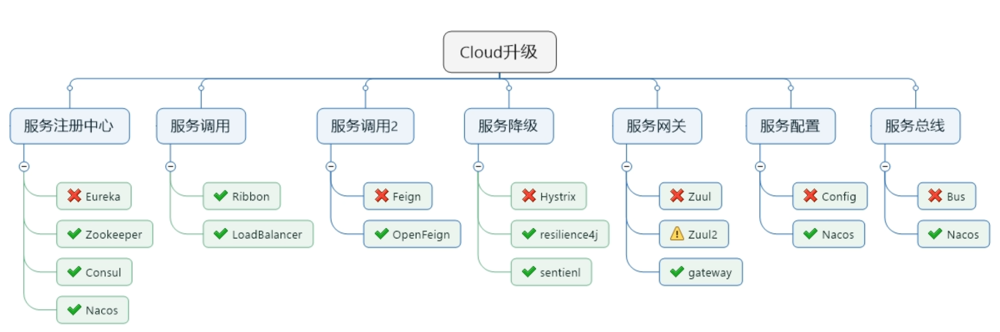

# 工程简介
用于个人学习springcloud

nacos使用的版本为nacos-server-2.2.0

下载地址：https://github.com/alibaba/nacos/releases

sentinel Dashboard使用的版本为v1.8.1

下载地址：https://github.com/alibaba/Sentinel/releases

启动命令：java -Dserver.port=8090 -Dcsp.sentinel.dashboard.server=localhost:8090 -Dproject.name=sentinel-dashboard -jar sentinel-dashboard-1.8.1.jar

# 延伸阅读

服务注册中心：

Eureka：官方停止更新，并且已经有更好的替代产品了，可以使用，但是官方已经不建议使用了（重度患者）。

Zookeeper：某些老系统，以前是用的Zookeeper + Dubbo，后来做技术升级，结果发现SpringCloud的Eureka停更了，然后就用了最少的技术切换，那么就用了Zookeeper做注册中心。

Consul：go语言开发的，也是一个优秀的服务注册框架，但是使用量较少，风头都被Nacos抢了。https://www.consul.io/downloads.html

Nacos：来自于SpringCloudAlibaba，在企业中经过了百万级注册考验的，不但可以完美替换Eureka，还能做其他组件的替换，所以强烈建议使用，是学习的重点。https://github.com/alibaba/nacos/releases

服务调用：

Ribbon：也进入了维护状态，停止更新了，但是Spring官方还在使用（轻度患者）。nacos新版本已不支持netflix ribbon，使用loadbalancer代替

LoadBalancer：Spring官方推出的一个新的组件，打算逐渐取代掉Ribbon，但是现在还处于萌芽状态。

服务调用2：

Feign：Netflix 公司产品，也停止更新了。

OpenFeign：Spring社区等不了Netflix更新了，然后就自己做了一个组件，不用Feign了。

服务降级：

Hystrix：官网不推荐使用，但是中国企业中还在大规模使用。

Resilience4J：官网推荐使用，但是国内很少用这个。

Sentienl：来自于SpringCloudAlibaba，在中国企业替换Hystrix的组件，国内强烈建议使用。实现资源流控、降级、热点、授权.

服务网关：

Zuul：Netflix 公司产品，公司内部产生分歧，有的人想自己出一个Zuul2。//Zuul与现版本springboot不兼容

Zuul2：也是Netflix 公司准备出的产品，但是由于内部分歧，所以Zuul2已经胎死腹中了。

gateway：Spring社区自己出的网关组件，官方隆重介绍和极度推荐的网关服务组件。

服务配置：

Config：目前也在使用，风头被Nacos抢了。

Nacos：来自于SpringCloudAlibaba，后来居上，把Config给替换了。

服务总线：

Bus：SpringCloud原生的服务总线组件，现在风头也被Nacos抢了。

Nacos：来自于SpringCloudAlibaba，后来居上，把Bus给替换了。